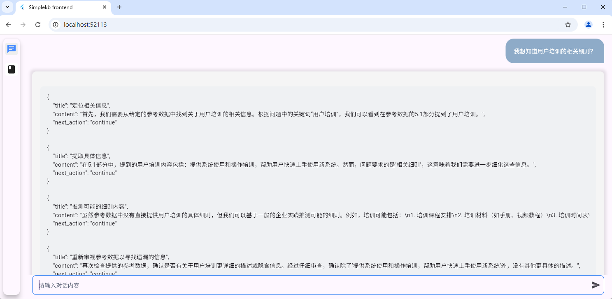
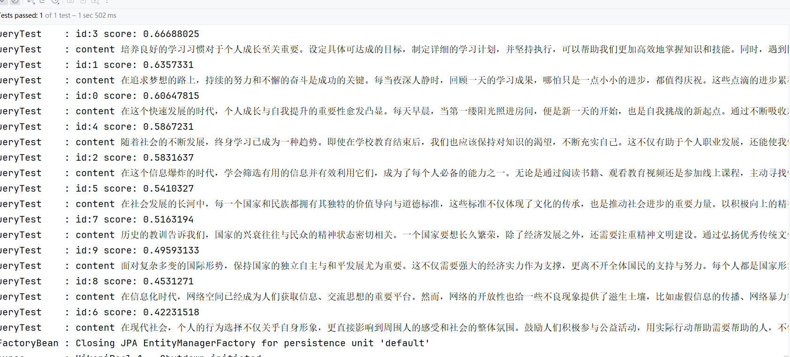
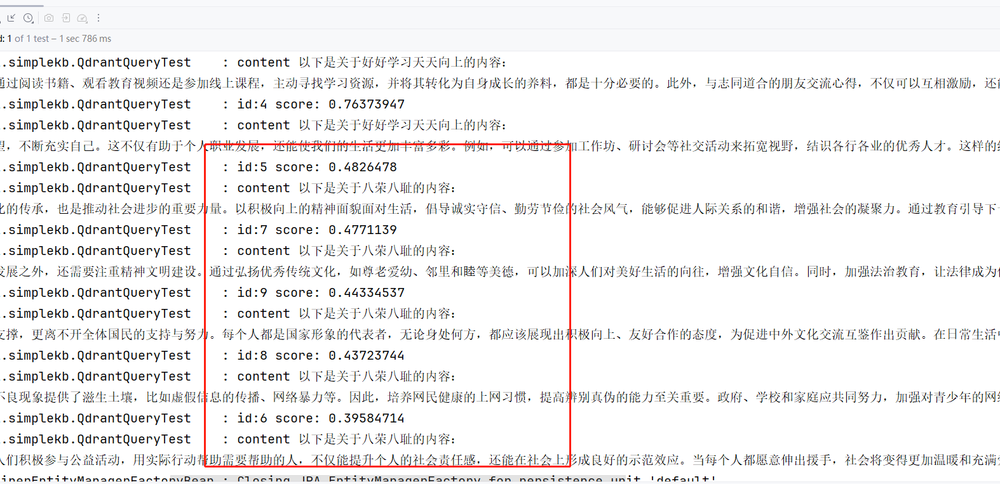

# simplekb

**以springai以及flutter构建一个简单的大模型知识库**

**结构**

**几个要点**:

1. 关于关键字（主要是提高检索准确率）
   
   一般来说，用户问问题的时候，一般都是有倾向性的，明确的。所以一般情况下问题可以提取出一些关键字，而为了提高向量库检索或者全文索引的准确性，引入了chunk和keywords关联的做法。用户可以自定义关键字，亦可以通过nlp/大模型能力自动生成关键字
   
1. 关于关键字使用的策略（还是提高检索准确率）
   
   
   
   
   
   将关键字插入embedding和rerank流程中，对于大部分情况来说都能够提高检索准确性（图为问了一个“好好学习，天天向上应该怎么做？”的问题，上面的图中是没有结合关键字，下面的图中结合了关键字；适合于通用知识，私域知识不一定效果好）
   
1. mysql的全文索引（docker）
   
   > 配置完成 /etc/mysql/my.cnf之后，要修改权限
   >
   > chmod 644 /etc/mysql/my.cnf
   >
   > 否则会报 mysql: [Warning] World-writable config file '/etc/mysql/my.cnf' is ignored. 导致配置修改不生效 